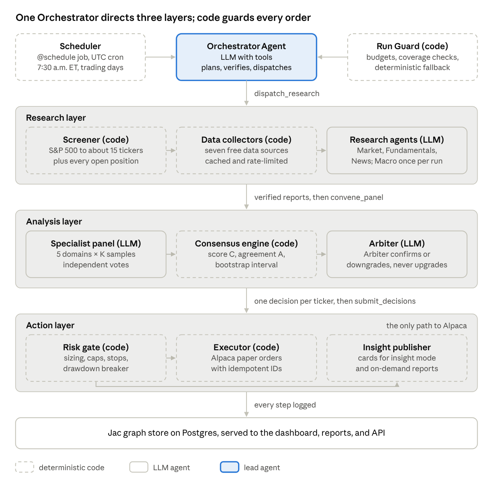
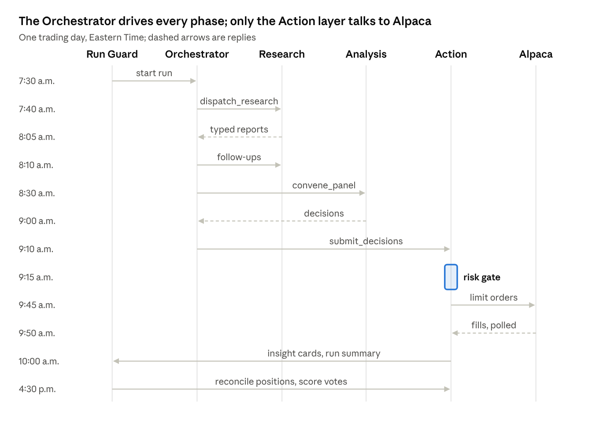
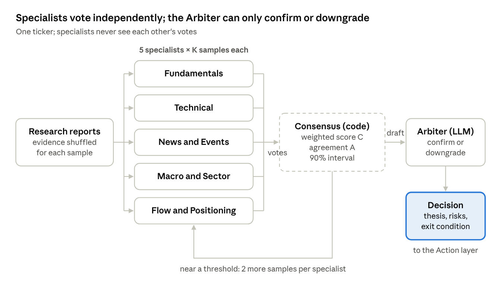
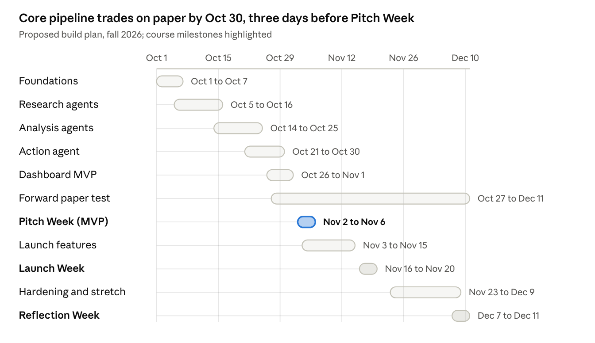

# TDD: Autonomous Trading Agent

EECS 449, Fall 2026 · Sep 30, 2026 · @Jeremy Moon

## 1. Overview

We will build a Jac-based multi-agent system that screens the S&P 500 every trading day, researches a shortlist of about 15 stocks from free data sources, decides through a stochastic consensus of domain-specialist agents, and trades on Alpaca paper accounts. A lead Orchestrator Agent directs the Research, Analysis, and Action agents. The MVP is due for Pitch Week (Nov 2–6, 2026) and the public release for Launch Week (Nov 16–20, 2026).

### Problem

Market-moving information is spread across prices, filings, news, and macro releases, and no retail investor can read all of it daily. LLM agents can, but published studies find that multi-agent designs help when work splits into parallel pieces with noisy inputs, and fail when agents hand unchecked decisions to each other ([Kim et al.](https://arxiv.org/abs/2512.08296); [Cemri et al.](https://arxiv.org/abs/2503.13657)). This design therefore uses multiple agents for research and for independent specialist opinions, and keeps one verified decision path and deterministic risk control.

### Goals

1. **Stocks first.** Trade S&P 500 constituents on Alpaca paper trading; crypto and prediction markets come later by adding research and specialist agents only.
2. **Orchestrated multi-agent pipeline.** An Orchestrator Agent plans each run, dispatches research sub-agents in parallel, verifies their reports, convenes the analysis specialists, and hands decisions to the Action Agent.
3. **Free data only.** Every research input comes from a free API tier or public source.
4. **Free model inference.** Every agent runs on a free model through OpenRouter, so the system has no per-token cost.
5. **Stochastic consensus.** Each trade decision aggregates repeated, independent samples from specialists in fundamentals, technicals, news, macro, and insider and institutional flow, so disagreement is measured rather than hidden.
6. **Two action modes.** Auto mode places paper orders; insight mode publishes the recommendation for a human to act on.
7. **Two user surfaces.** A public dashboard of the team-run portfolio, and on-demand insight reports for any S&P 500 ticker.
8. **Full transparency.** Every report, vote, decision, risk check, and order is logged and viewable.
9. **Nice-to-have features,** which are stretch goals (Section 16) and start only after the core works.

### Non-goals

- Real-money trading, brokerage custody, or personalized investment advice.
- Intraday or high-frequency trading; the agent makes swing decisions once per trading day.
- Paid data feeds, paid model APIs, options trading, short selling, and leverage.
- Training or fine-tuning models.

### Success criteria

| Area | Metric | Target |
| --- | --- | --- |
| Decision quality | Sharpe ratio of the team portfolio | Above SPY buy-and-hold over the same window |
| Risk | Maximum drawdown | No worse than SPY over the same window |
| Reliability | Daily runs that produce a valid, logged decision set | At least 98% |
| Safety | Orders that bypass the risk gate | Zero |
| Model usage | Free-model requests per day | Within OpenRouter's daily cap (Section 12) |
| Product | On-demand report latency | Under 5 minutes at the 95th percentile |
| Launch | Real users who view the dashboard or request a report during Launch Week | 50 (proposed) |

## 2. System architecture

The system is a centralized multi-agent design: one LLM Orchestrator Agent directs three agent layers (Research, Analysis, Action) through tools, and deterministic Jac code enforces every invariant the Orchestrator must not break. The Orchestrator decides what to investigate and when evidence is good enough; code decides what is allowed.



Dashed boxes are deterministic code and solid boxes are LLM agents; the Orchestrator reaches Alpaca only through the risk gate.

### Components

| Layer | Component | Type | Responsibility |
| --- | --- | --- | --- |
| Trigger | Scheduler | Static `@schedule` job (`[scale.scheduler]`, UTC cron) | Starts the daily run at 7:30 a.m. ET on trading days and the post-close review at 4:30 p.m. ET, firing at both UTC offsets and proceeding only when New York time matches |
| Control | Orchestrator Agent | LLM with tools (`by llm(tools=[...])`) | Plans the run, dispatches research, verifies reports, requests follow-ups, convenes the analysis panel, reviews decisions, writes the run summary |
| Control | Run Guard | Deterministic walker | Enforces step and token budgets, checks that every shortlisted ticker ends with a decision, and falls back to a fixed plan if the Orchestrator fails |
| Universe | Screener | Deterministic code | Narrows the S&P 500 to about 15 tickers plus all open positions (Section 5) |
| Research | Data collectors | Deterministic code | Pull and cache raw data from free APIs (Section 6) |
| Research | Research sub-agents | LLM, one per domain | Turn raw data into structured, cited `ResearchReport` objects |
| Analysis | Specialist panel | LLM, five roles × K samples | Produce independent votes with confidence and rationale (Section 7) |
| Analysis | Consensus engine | Deterministic code | Aggregates votes into a score, an agreement measure, and a draft action |
| Analysis | Arbiter | LLM | Checks the consensus against the evidence and writes the final thesis and exit condition |
| Action | Portfolio constructor | Deterministic code | Converts decisions into target weights and order quantities |
| Action | Risk gate | Deterministic code | Rejects or resizes anything that breaks portfolio limits (Section 8) |
| Action | Executor | Deterministic code | Places, monitors, and reconciles orders on Alpaca paper accounts |
| Action | Insight publisher | Deterministic code | Posts decisions as plain-English insight cards for users |
| Product | API and dashboard | `def:pub` functions and walkers as REST endpoints; jac-client React UI | Serves the dashboard, on-demand reports, and account connections (Sections 9–10) |
| State | Graph store | Jac persistent graph on Postgres (embedded locally, provisioned when deployed) | Holds runs, reports, votes, decisions, orders, and users (Section 11) |

### Design principles

1. **Agents advise; code enforces.** No LLM output reaches Alpaca without passing the risk gate, and the Orchestrator has no tool that places orders directly.
2. **Parallel where independent, single where sequential.** Research sub-agents and specialist samples run in parallel; each ticker still gets exactly one final decision.
3. **Typed handoffs.** Every agent returns a Jac `obj` that byLLM validates, so a malformed output fails loudly instead of flowing downstream.
4. **Everything is replayable.** Raw inputs, prompts, outputs, and model versions are stored per run, so any decision can be audited on the dashboard.
5. **Asset-agnostic core.** Crypto and prediction markets plug in as new collectors, research sub-agents, and specialists; the Orchestrator, consensus engine, risk gate, and dashboard stay the same.
6. **Every model call fails safe.** Each `by llm` call site catches provider errors and exhausted parse retries and records a deterministic default, such as HOLD for a ticker, so one bad response never stops a run.
   A kill switch runs the whole pipeline with no model calls, which the fallback drill and CI use.

## 3. Tech stack and Jac implementation

The whole backend, agent layer, and dashboard are written in Jac: agents are `by llm()` functions with typed returns, the pipeline is a walker that traverses a persistent graph, and the Jac server turns `def:pub` functions and walkers into authenticated REST endpoints.
Python libraries (pandas, alpaca-py, requests) are imported directly, since Jac compiles to Python bytecode.
The project pins Jac 0.37.12 (`jac-version = "==0.37.12"` in `jac.toml`).
Jac replaced its storage engine and its serve command within the two minor releases before this one, so the team does not upgrade mid-semester, and the version-matched `jac guide` references bundled with the compiler outrank the website docs wherever they disagree.

### Stack

| Concern | Choice | Why |
| --- | --- | --- |
| Language | Jac 0.37.12 ([docs](https://docs.jaseci.org/llms.txt); bundled `jac guide` references) | Course requirement; graphs, walkers, LLM calls, APIs, and UI in one language |
| LLM integration | byLLM ([reference](https://docs.jaseci.org/reference/plugins/byllm/)) over LiteLLM | Return types become enforced output schemas; `ModelPool` gives model fallback; one config value switches models |
| Model provider | OpenRouter free model variants ([limits](https://openrouter.ai/docs/api-reference/limits)), reached through LiteLLM's OpenRouter support ([LiteLLM](https://docs.litellm.ai/docs/providers/openrouter)) | No per-token cost; Section 12 covers the model choice and request limits |
| Server | Jac's built-in HTTP server, `jac run` (`jac run --dev` locally) | `def:pub` functions and walkers become `/function/<name>` and `/walker/<name>` endpoints with OpenAPI docs at `/docs`, JWT auth, and Postgres persistence |
| Hosting | `jac scale deploy` ([production guide](https://docs.jaseci.org/production/)) | Deploys to an existing Kubernetes cluster through a kubeconfig and provisions Postgres and an NGINX ingress; it has no AWS- or GCP-specific provisioning, so the team picks the cluster in week 1 |
| Frontend | jac-client components ([full-stack guide](https://docs.jaseci.org/full-stack/)) | React-style JSX in the same codebase; placement (client or server) is inferred and pinned with `[placement]` in `jac.toml`; components call `def:pub` functions with `await` |
| Scheduling | Built-in scheduler (`[scale.scheduler]`, APScheduler, `@schedule`) | Runs the morning and post-close jobs inside the app as the system user, with no external cron; cron expressions are UTC and fire once per replica |
| Concurrency | `flow` / `wait` for blocking I/O ([reference](https://docs.jaseci.org/reference/language/concurrency/)) | Collectors are network-bound, so threads give real speedup; `flow` shares one pool of min(32, CPUs + 4) threads; model calls are limited by OpenRouter's request cap instead |
| Broker | Alpaca Trading API, paper environment, via alpaca-py | Free paper trading with real-time IEX data |
| Storage | Jac graph on Postgres: embedded in development, a provisioned StatefulSet (or `JAC_DB_URL`) when deployed | Nodes persist automatically once reachable from `root` or `root.shared`; large payloads go to `store()` |
| Testing | `MockLLM`, Jac `test` blocks, Hypothesis, recorded API fixtures | Deterministic CI that uses no model requests |
| Observability | byLLM telemetry callback; admin-only `/admin/llm/telemetry/summary` and `/traces`; Prometheus metrics through `[scale.monitoring]` | Per-agent latency, call counts, and error rates |
| Dev tooling | GitHub and the Flowline board; Claude Code | Course workflow; AI-assisted development |

### How the Jac concepts map to the design

| Jac concept | Used for |
| --- | --- |
| `node` | Persistent entities: `Run`, `Ticker`, `ResearchReport`, `Vote`, `Decision`, `Order`, `Portfolio`, `UserProfile` |
| `edge` | Typed relationships declared with endpoints, such as `edge Covers: Run --> Coverage {}` and a `Decision` to its `Order` |
| `obj` | Typed agent inputs and outputs, validated by byLLM and copied into nodes for storage |
| `enum X: str` | Values an agent returns, such as `Stance`; string values match what the model writes, while a plain enum serializes as integers and rejects `"BUY"` |
| `def ... by <role_llm>()` | Each agent role, called through that role's own model instance; `sem` strings carry the role instructions |
| `by <role_llm>(tools=[...])` | The Orchestrator's ReAct loop over sub-agent tools, bounded by `max_react_iterations` and an `on_iteration` hook that can return `ABORT_WITH_SUMMARY` |
| `obj LimitedPool(ModelPool)` | One subclass that gates every provider request through the shared rate limiter and falls back to a second model |
| `walker` | The daily pipeline and any endpoint that traverses the graph |
| `def:pub` | Dashboard and report endpoints that only read or compute; preferred over walkers when no traversal is needed |
| `:pub` vs. default visibility | `:pub` endpoints allow anonymous callers and read public data from `root.shared`; default endpoints (identical to `:priv`) require a JWT and run on the caller's own root |
| `root.shared` and `grant()` | The public team graph, written by the scheduled job and opened read-only per node with `grant(node, level=AccessLevel.READ)` |
| jac-client components | Dashboard pages, which call `def:pub` functions with `await` or spawn walkers and read `.reports` |
| `@schedule` | The 7:30 a.m. run and the 4:30 p.m. post-close job, registered in UTC (Section 4) |

### Code sketch

The sketch below shows the shape of the code.
It passes `jac check` with every lint rule enabled and its tests pass on Jac 0.37.12; only the HTTP target and the screen are placeholders.
This `jac.toml` is the single copy of the model configuration; Section 12 refers to it.

```toml
# jac.toml
[project]
name = "trading-agent"
kind = "web-app"
jac-version = "==0.37.12"

[byllm]
[byllm.model]
default_model = "openrouter/qwen/qwen3.8-27b:free"   # OPENROUTER_API_KEY exported in the environment

[byllm.call_params]
temperature = 0.2
max_output_retries = 1        # each parse retry is another OpenRouter request

[placement]
default = "server"            # pin client modules explicitly under [placement.pins]

[scale.scheduler]
enabled = true

[serve.auth]
secret = "${JAC_SERVE_AUTH_SECRET}"

[scale.admin]
default_password = "${ADMIN_PASSWORD}"
```

```jac
# agents/models.jac: one model instance per role, every request rate limited
import threading;
import time;
import from jaclang.byllm.lib { Model, ModelPool }

glob PRIMARY: str = "openrouter/qwen/qwen3.8-27b:free";
glob FALLBACK: str = "openrouter/openrouter/free";   # the Free Models Router
glob RPM_LIMIT: int = 18;

glob _slot_lock: threading.Lock = threading.Lock();
glob _last_slot: list[float] = [0.0];

"""Block until the shared 18-per-minute budget allows one more request."""
def request_slot {
    with _slot_lock {
        wait_s = _last_slot[0] + 60.0 / RPM_LIMIT - time.monotonic();
        if wait_s > 0 { time.sleep(wait_s); }
        _last_slot[0] = time.monotonic();
    }
}

"""Every provider request, including parse retries and ReAct iterations, passes the limiter."""
obj LimitedPool(ModelPool) {
    override def model_call_no_stream(params: dict[str, object]) -> dict[str, object] {
        request_slot();
        return super.model_call_no_stream(params);
    }
}

def role_model -> LimitedPool {
    return LimitedPool(
        models=[Model(model_name=PRIMARY), Model(model_name=FALLBACK)],
        strategy="fallback",
        num_retries=1
    );
}

# `by m(temperature=...)` overwrites m's call params, so roles that share an
# instance leak settings into each other's concurrent calls.
glob research_llm: LimitedPool = role_model();
glob specialist_llm: LimitedPool = role_model();
glob arbiter_llm: LimitedPool = role_model();
glob orchestrator_llm: LimitedPool = role_model();
```

```jac
# models/agents.jac: typed handoffs, with no server-only imports
enum Stance: str {
    STRONG_SELL = "STRONG_SELL",
    SELL = "SELL",
    HOLD = "HOLD",
    BUY = "BUY",
    STRONG_BUY = "STRONG_BUY"
}

glob STANCE_SCORE: dict[Stance, int] = {
    Stance.STRONG_SELL: -2, Stance.SELL: -1, Stance.HOLD: 0, Stance.BUY: 1, Stance.STRONG_BUY: 2
};

obj Evidence { has claim: str, source_url: str, published: str; }

obj ResearchReport {
    has domain: str, ticker: str, as_of: str;
    has summary: str, view: Stance, confidence: float;
    has evidence: list[Evidence] = [], risks: list[str] = [], data_gaps: list[str] = [];
}

obj Vote {
    has specialist: str, stance: Stance, confidence: float;
    has horizon_days: int, rationale: str;
    has cited_evidence: list[int] = [];

    # Raising here counts as a parse failure, so byLLM retries with feedback.
    def postinit {
        if self.confidence < 0.0 or self.confidence > 1.0 {
            raise ValueError(f"confidence out of range: {self.confidence}");
        }
    }
}
sem Vote.confidence = "Probability in [0, 1] that the stance is right over horizon_days.";
sem Vote.cited_evidence = "Indices of the evidence items this vote relies on; never empty.";
```

```jac
# agents/specialists.jac
import from agents.models { specialist_llm }
import from models.agents { ResearchReport, Vote }

def fundamentals_specialist(ticker: str, reports: list[ResearchReport]) -> Vote
    by specialist_llm(temperature=0.8);
sem fundamentals_specialist = "You are a buy-side fundamentals analyst. Judge only valuation, growth, margins, balance sheet, and guidance. Cite evidence by index.";
sem fundamentals_specialist.reports = "Typed research reports; evidence is indexed in order.";
```

```jac
# research/collectors.jac
import requests;
import from concurrent.futures { Future }

obj RawBundle {
    has ticker: str;
    has payload: dict[str, str] = {};
    has error: str = "";
}

"""Blocking HTTP only: flow workers do not see the request's root, so no graph access here."""
def collect_data(ticker: str) -> RawBundle {
    try {
        resp = requests.get(f"https://example.invalid/{ticker}", timeout=10);
        return RawBundle(ticker=ticker, payload={"status": str(resp.status_code)});
    } except requests.RequestException as e {
        return RawBundle(ticker=ticker, error=str(e));
    }
}

"""The parameter pins `ticker` per task; `[flow f(t) for t in xs]` races the loop variable."""
def start_collect(ticker: str) -> Future[RawBundle] {
    return (flow collect_data(ticker)) as Future[RawBundle];
}

def collect_all(tickers: list[str]) -> list[RawBundle] {
    futures = [start_collect(t) for t in tickers];
    return [(wait f) as RawBundle for f in futures];
}
```

```jac
# run/pipeline.jac
import from research.collectors { RawBundle, collect_all }

node Run {
    has run_date: str;
    has status: str = "running";
}
node Coverage {
    has ticker: str;
    has fetch_error: str = "";
}
edge Covers: Run --> Coverage {}

walker DailyRun {
    has run_date: str = "";

    can start with Root entry {
        shortlist = screen_universe(self.run_date);         # deterministic, no model requests
        raw: list[RawBundle] = collect_all(shortlist);      # parallel blocking HTTP
        run = here ++> Run(run_date=self.run_date);         # graph writes after wait, on this thread
        for b in raw {
            run +>:Covers():+> Coverage(ticker=b.ticker, fetch_error=b.error);
        }
        run.status = "collected";
        # research sub-agents, Orchestrator verification, panel, consensus, Arbiter,
        # risk gate, executor; every model request passes the shared limiter
        report run;
    }
}
```

### Jac implementation rules

These rules come from spikes run on Jac 0.37.12 and from the team's earlier Jac project; each one prevents a failure that compiles cleanly and only shows up at run time.

1. **One model instance per role.** `by m(temperature=0.8)` writes its arguments into `m`'s shared settings, so concurrent calls through one instance send each other's temperatures; in a spike, 44 of 80 concurrent calls went out with the wrong value, and a nested sub-agent leaked its temperature into the Orchestrator.
   Research, specialists, Arbiter, Orchestrator, and the low-temperature retry path each get their own instance.
2. **Rate limiting and 429 handling are ours.** byLLM has no limiter and raises `RateLimitError` on a 429 without retrying or reading `Retry-After`.
   The `LimitedPool` subclass gates every provider request, and the call-site wrapper backs off on 429s.
3. **Budget for retries.** A failed parse is retried up to `max_output_retries` times with corrective feedback, and every retry is a request.
   The project sets it to 1; after that, the call site catches `OutputConversionError` (imported from `jaclang.byllm.lib`) and falls back as in Section 4.
4. **String enums for model outputs.** A plain `enum` serializes as integers, so the model's `"BUY"` fails validation; `enum Stance: str` with a score map in code avoids that.
   Ranges such as confidence in [0, 1] are not part of the schema, so they go in `sem` text and in a `postinit` check, which byLLM treats as a parse failure and retries.
5. **Launch `flow` through a helper.** The call inside `flow` runs on the worker thread, so a loop or comprehension variable can change before it is read; a helper whose parameter holds the value fixes it.
6. **No graph access inside `flow`.** Worker threads do not inherit the request context and see the super root, so collectors return values and every graph write happens on the walker's thread after `wait`.
7. **Every endpoint is imported by `main.jac`.** A `def:pub` function that the serving entry module does not import is not exposed for POST and returns 405, which hit the team's previous project; a smoke test POSTs every endpoint.
8. **Pin placement.** Code reachable from the client cannot use Python imports, so `[placement] default = "server"` keeps agents, collectors, pandas, and alpaca-py on the server, and only dashboard modules are pinned to the client.
   Types returned to the dashboard live in `models/` with no server-only imports, and endpoints never return DataFrames.
9. **Public data lives on `root.shared`.** A signed-in user calling a `:pub` endpoint runs on their own root, so public reads name `root.shared` explicitly, and the scheduled job grants READ on every public node it creates; a grant covers one node, not its subtree.
10. **`jac run` does not read `.env`.** Developers export variables (for example with direnv), and deployments use `[scale.secrets]`.
11. **No date math in prompts.** Trading days, horizons, and time stops are computed in code and passed to agents as labels; timestamps are stored in UTC and converted to New York time only for market-hours logic.
12. **Cap what agents read.** Tool results and prompts are length-capped and pass compact summaries, never raw bars or filings.
13. **Long work runs outside requests.** The daily run is a scheduled job, and on-demand reports are queued and polled (Section 4), so no HTTP request holds a server worker for minutes.

### Repository layout

```
trading-agent/
  jac.toml                 # pinned Jac version, byLLM, placement, scheduler, scale config
  main.jac                 # server entry: imports every endpoint
  models/                  # node, edge, obj, and enum definitions; no server-only imports
  agents/                  # role model instances, orchestrator, research sub-agents, specialists, arbiter
  research/                # collectors (one module per source, with caching and rate limits), screener
  analysis/                # consensus engine, indicators
  action/                  # portfolio constructor, risk gate, executor
  run/                     # DailyRun walker, Run Guard, scheduled jobs
  dashboard/               # client pages and components, beside the def:pub endpoints they call
  tests/                   # integration tests, recorded API fixtures, backtest harness
  .github/workflows/       # CI only; scheduling runs inside the app
```

Unit tests sit next to their modules as `module.test.jac` or `module_tests.jac`; files named `test_*.jac` are not allowed.
Imports are absolute from the project root (`import from analysis.consensus { ... }`), since relative `..` imports break `jac test`.
Moving a module that declares node types orphans their persisted data, so the layout is frozen in the Foundations phase, before the forward test stores anything.

## 4. Orchestration and daily pipeline

Each trading day runs one pipeline from 7:30 a.m. to 10:00 a.m. ET, plus a post-close review at 4:30 p.m. ET. The Orchestrator Agent drives the pipeline through tools; the Run Guard wraps it with budgets, coverage checks, and a deterministic fallback.



The Orchestrator talks only to the agent layers; Alpaca sees nothing until the risk gate has approved an order.

### Daily schedule (Eastern Time)

The scheduler evaluates cron expressions in UTC, so each job is registered at both its EDT and EST offsets (for example `cron="30 11,12 * * 0-4"`, where day 0 is Monday) and proceeds only if New York time matches; the run-date idempotency key stops a second firing, including the one-per-replica firing on a multi-replica deploy.

| Time | Phase | Owner | Output |
| --- | --- | --- | --- |
| 7:30 a.m. | Preflight: check the Alpaca market calendar, API health, and budget | Run Guard | Go or skip; `Run` node created |
| 7:32 a.m. | Screen the S&P 500 | Screener | Shortlist of about 15 tickers plus open positions |
| 7:35 a.m. | Macro brief, once per run | Macro research sub-agent | One `MacroReport` shared by every ticker |
| 7:40 a.m. | Research fan-out, in parallel | Research sub-agents | Three domain reports per ticker |
| 8:10 a.m. | Verify reports; request up to two follow-ups per ticker | Orchestrator | Verified report set, or a forced HOLD with a reason |
| 8:30 a.m. | Specialist panel and consensus | Analysis layer | One `ConsensusResult` per ticker |
| 9:00 a.m. | Arbiter review | Arbiter | One `Decision` per ticker with thesis and exit condition |
| 9:10 a.m. | Portfolio review and submission | Orchestrator | Decision set sent to the Action layer |
| 9:15 a.m. | Sizing and risk gate | Action layer | Approved, resized, or rejected orders |
| 9:45 a.m. | Execution window, after the opening auction settles | Executor | Limit orders on Alpaca paper |
| 10:00 a.m. | Publish insight cards and run summary | Insight publisher | Dashboard updated |
| 4:30 p.m. | Post-close: reconcile fills, mark to market, score yesterday's votes | Run Guard + Executor | Performance metrics; specialist accuracy updated |

### Orchestrator tools

The Orchestrator is a `by orchestrator_llm(tools=[...])` function running on the same free model as every other agent, through its own model instance (Section 3).
It can only act through these tools.
Tools take ticker lists, so a 20-ticker run fits inside the iteration cap: covering each ticker one tool call at a time would need more than 40 iterations.

| Tool | What it does | Limits |
| --- | --- | --- |
| `get_run_context()` | Returns the shortlist, portfolio, macro brief, and budget remaining | Read only |
| `dispatch_research(tickers, domains)` | Runs the named research sub-agents for a batch of tickers in parallel | Once per ticker per domain |
| `request_followup(ticker, domain, question)` | Re-runs one sub-agent with a targeted question, such as resolving a conflict between news and filings | Two per ticker |
| `flag_ticker(ticker, reason)` | Marks a ticker as unreliable today; forces HOLD | Logged and shown on the dashboard |
| `convene_panel(tickers)` | Runs the specialist panel, consensus engine, and Arbiter for a batch of tickers | Once per ticker; requires verified reports |
| `submit_decisions(decisions)` | Sends the decision set to the Action layer | Once per run; passes through the risk gate |
| `write_run_summary(text)` | Stores the day's plain-English summary | Once per run |

### Run Guard invariants

- **Request budget.** One shared limiter caps every model request in the app at 18 per minute, under OpenRouter's free-model limit of 20.
  byLLM has no built-in limiter, so the limiter lives in the `LimitedPool` model class (Section 3) and also counts parse retries and ReAct iterations.
  The Orchestrator's ReAct loop has a hard iteration cap (`max_react_iterations`) and an `on_iteration` hook that returns `ABORT_WITH_SUMMARY` when the run's request budget is spent; the hook runs between iterations, so a tool that is already running finishes first.
- **Coverage.** Every shortlisted ticker and every open position ends the run with a `Decision`; a ticker lacking market, fundamentals, and news reports defaults to HOLD with reason "insufficient data."
- **Fallback.** If the Orchestrator errors, times out, or aborts, the Run Guard executes the same phases in fixed order with no follow-ups.
  The dashboard marks the run as "fallback."
- **Idempotency.** The run ID is the trading date, and the job claims its `Run` node before doing any work, so a second firing of the scheduler exits at once.
  Every order's `client_order_id` is derived from run ID and ticker, so a job that fires twice cannot double-trade.
- **Staleness.** Collectors stamp every datum with its fetch time; data older than its freshness limit is excluded and listed in the report's `data_gaps`.

### Failure handling

| Failure | Behavior |
| --- | --- |
| A free data API is down or rate-limited | Retry with backoff; then use cached data inside its freshness limit; else record a data gap |
| An agent's output fails type validation | byLLM retries the parse once with corrective feedback (`max_output_retries = 1`); if that fails, the call site catches `OutputConversionError` and calls the same role once at temperature 0.2 through a separate model instance; then it drops that sample and counts it against the reliability metric |
| A model call raises any other error | Caught at the call site; the sample is dropped, or the ticker defaults to HOLD, with the error recorded |
| Fewer than 60% of specialist samples succeed for a ticker | Force HOLD for that ticker |
| OpenRouter returns 429 (rate limited) | byLLM raises `RateLimitError` without retrying, so the call-site wrapper backs off exponentially, honoring the `Retry-After` header when present |
| The free model is unavailable or leaves the free list | Each `LimitedPool` falls back to OpenRouter's Free Models Router (`openrouter/openrouter/free`); the app alerts the team |
| The daily free-model cap is nearly used up | Run in reduced mode (K = 1, shortlist of 10); existing stop orders stay in force |
| Alpaca rejects an order | Log the rejection, surface it on the dashboard, and do not retry automatically |
| Market holiday or early close | Preflight checks Alpaca's market calendar and skips the run or shifts the execution window |

### On-demand report flow

When a user requests a report on any S&P 500 ticker, the same Orchestrator runs in report mode: it has no `submit_decisions` tool, and its output is an insight card rather than an order.
Reports are cached per ticker per trading day and shared across users, and tickers already on the day's shortlist reuse the morning's research without new model requests.
Each user can request three new reports per day (proposed).
A report takes minutes, so it never runs inside the HTTP request: the endpoint records a `ReportRequest` and returns a pending status, a scheduled interval job processes the queue in order, and the Reports page polls until the card is ready.

## 5. Universe selection: S&P 500 screen

A deterministic screen, with no LLM calls, narrows about 500 constituents to a shortlist of 15 new candidates each morning, and every open position is added on top. This keeps LLM cost proportional to the shortlist rather than the index and makes the screen reproducible.

### Steps

1. **Load constituents.** Refresh the S&P 500 list weekly from the public Wikipedia "List of S&P 500 companies" table; store GICS sector and sub-industry.
   The same page's table of past changes rebuilds point-in-time membership, which the historical harness uses instead of today's list to avoid survivorship bias.
2. **Check tradability.** Keep symbols that Alpaca's `/v2/assets` endpoint marks active and tradable.
3. **Pull daily bars.** Fetch one year of daily bars for all constituents through Alpaca's multi-symbol bars endpoint (a few dozen requests, well inside the free plan's 200 requests per minute).
4. **Filter for liquidity.** Drop names below $50 million of 20-day average dollar volume (proposed).
5. **Score attention and setup.** Compute the composite score below from price, volume, news, and event features.
6. **Diversify.** Take the top 15 by score with at most three per GICS sector.
7. **Add mandatory names.** Append every open position, so exits are always evaluated.
8. **Allow wildcards.** The Orchestrator may add up to three tickers from the macro brief or breaking news, with a logged reason.

### Composite score

$$
S_i = w_1 z(\text{mom}_{20}) + w_2 z(\text{mom}_{60}) + w_3 z(\text{rvol}_{5}) + w_4 z(\text{news}_{3}) + w_5\,\mathbb{1}[\text{earnings} \le 5\text{d}] - w_6 z(\text{vol}_{20})
$$


Here mom is total return over 20 and 60 trading days, rvol is 5-day volume relative to its 60-day average, news is the 3-day article count from Alpaca's news feed, the indicator flags an earnings date within 5 trading days, vol is 20-day realized volatility, and z is the cross-sectional z-score. Starting weights are equal (w = 1); the evaluation harness tunes them on history before launch, and they are frozen during the live test.

### Why a quant screen first

The screen is intentionally simple: it decides where to spend agent attention, not what to buy. Its hit rate is measured separately, by comparing next-10-day returns of shortlisted names against the rest of the index, so the team can tell whether gains come from the screen or from the agents.

## 6. Research Agent: free data sources and sub-agents

The Research layer draws on seven free sources through three per-ticker sub-agents (Market, Fundamentals, News) and one per-run Macro sub-agent. Deterministic collectors fetch and cache the raw data; LLM sub-agents only read what the collectors return and must cite a source URL for every claim. Social-media and alternative data sources are stretch goals (Section 16).

### Research sub-agents

| Sub-agent | Scope | Main inputs | Runs |
| --- | --- | --- | --- |
| Market and Technical | Trend, momentum, volatility, volume, relative strength | Alpaca daily bars; indicators computed in code | Per ticker |
| Fundamentals and Filings | Growth, margins, balance sheet, valuation, guidance, insider and institutional activity | SEC XBRL company facts, 10-K/10-Q/8-K text, Form 4, 13F; Finnhub key metrics, recommendation trends, EPS surprises | Per ticker |
| News and Events | What happened, what is scheduled, and whether news is priced in | Alpaca news (Benzinga), Finnhub company news and earnings calendar, SEC 8-K filings | Per ticker |
| Macro | Rates, inflation, growth, volatility regime, sector rotation | FRED series such as DGS2, DGS10, VIXCLS, CPIAUCSL, and UNRATE; sector ETF bars from Alpaca | Once per run |

Indicators are computed in code (pandas), never by the LLM: 20/50/200-day moving averages, RSI(14), MACD, Bollinger width, ATR(14), 52-week range position, relative strength against SPY and the sector ETF, and relative volume.

### Source inventory

| Source | Data | Access | Free allowance (as checked) | Used by | Notes |
| --- | --- | --- | --- | --- | --- |
| [Alpaca Market Data, Basic](https://docs.alpaca.markets/us/docs/about-market-data-api) | Stock and ETF bars since 2016; real-time IEX quotes | REST + WebSocket, API key | Free; 200 historical calls/min; 30 WebSocket symbols; latest 15 minutes of consolidated data restricted | Screener, Market, Macro | Daily decisions use prior-day bars, so the 15-minute restriction does not matter |
| [Alpaca News](https://docs.alpaca.markets/us/docs/historical-news-data) | Benzinga news since 2015, about 130 articles a day | REST + WebSocket | Same free key | News, Screener | Primary news source |
| Alpaca Trading API (assets, calendar) | Tradable symbols; market days and hours | REST, API key | Free | Screener, Run Guard | Tradability checks and holiday detection |
| [SEC EDGAR APIs](https://www.sec.gov/os/accessing-edgar-data) | Filing index, XBRL company facts, filing text, Form 4, 13F, 8-K | REST (`data.sec.gov`), no key | 10 requests/second with a declared User-Agent | Fundamentals, News | User-Agent with a team contact email is required |
| [Finnhub, free](https://finnhub.io/pricing) | Company news (1 year), earnings calendar (1 month), recommendation trends, EPS surprises (4 quarters), key metrics | REST, API key | 60 calls/min; U.S. only; personal-use license | Fundamentals, News | Show derived results, not raw data |
| [FRED](https://fred.stlouisfed.org/docs/api/api_key.html) | Treasury yields, VIX close, fed funds, CPI, unemployment, and other series | REST, free API key | Free | Macro | Official Federal Reserve data |
| S&P 500 constituents | Current members and GICS sectors | Wikipedia "List of S&P 500 companies" table | Free | Screener | Weekly refresh |

Social sources (Reddit, StockTwits, Bluesky, Wikipedia pageviews, Google Trends), options and short-sale data, and backup data providers are stretch goals (Section 16). X (Twitter) is excluded because its API is paid, and earnings call transcripts are excluded because no reliable free source exists; earnings press releases filed with 8-Ks cover most of the same facts.

### Collector rules

- **One module per source**, each with a token-bucket rate limiter, retries with backoff, and a per-source freshness limit.
- **Cache first.** Raw responses are cached by source, symbol, and date; filings and historical bars are cached indefinitely, news for 24 hours.
- **Budget the free tiers.** The per-run call budget stays under 50% of each daily allowance, so on-demand reports never exhaust a quota.
- **Normalize and stamp.** Every datum carries its source URL, publish time, and fetch time before it reaches an agent.
- **Respect licenses.** Several free tiers are personal or non-commercial. The public dashboard shows derived analysis and links to sources, not redistributed raw data.

### Actions

- [ ] Create team Alpaca paper accounts and API keys
- [ ] Create the OpenRouter account and buy $10 of credits once, which raises the free-model cap from 50 to 1,000 requests a day
- [ ] Check the OpenRouter account's privacy settings allow the chosen free models, since some free endpoints refuse requests unless prompt logging is permitted
- [ ] Register free Finnhub and FRED API keys
- [ ] Set the SEC User-Agent with a team contact email
- [ ] Store every key in exported environment variables locally (`jac run` does not read `.env`) and in `[scale.secrets]` when deployed, never in the repo

## 7. Analysis Agent: stochastic consensus

Five domain specialists each vote independently several times per ticker; code aggregates the votes into a consensus score, an agreement measure, and a bootstrap confidence interval; and one Arbiter confirms or downgrades the result. Specialists never see each other's votes, which avoids the error amplification reported for multi-agent systems without verification ([Kim et al.](https://arxiv.org/abs/2512.08296)).



Votes flow one way into code; only an ambiguous result loops back for more samples, and the Arbiter's output is capped at the consensus.

### Specialists

| Specialist | Judges only | Primary reports |
| --- | --- | --- |
| Fundamentals | Valuation, growth, margins, balance sheet, guidance, earnings quality | Fundamentals and Filings |
| Technical | Trend, momentum, support and resistance, volatility, relative strength | Market and Technical |
| News and Events | Materiality of news, whether it is priced in, upcoming catalysts such as earnings | News and Events |
| Macro and Sector | Rate and inflation regime, sector rotation, sensitivity to scheduled releases | Macro; sector ETF data |
| Flow and Positioning | Insider buying and selling, changes in institutional holdings | Fundamentals and Filings (Form 4, 13F) |

A Critic role that writes the strongest opposing case for the Arbiter is a stretch goal (Section 16).

### Where the randomness comes from

1. **Temperature sampling.** Each specialist is called K times at temperature 0.8.
2. **Evidence permutation.** Each sample receives the report's evidence items in a different random order, reducing position bias.

K starts at 3. If the result sits near a decision threshold, the engine draws 2 more samples per specialist (sequential sampling), so model requests scale with ambiguity.

### Vote format

Each sample returns a typed `Vote`: a stance from STRONG\_SELL to STRONG\_BUY, a confidence from 0 to 1, a horizon in trading days, a rationale, and the indices of the evidence it relied on.
The stance is a string enum that code maps to a score from −2 to +2 (Section 3).
A vote that cites no evidence is discarded.

### Aggregation

Each sample k from specialist s becomes a signed score, and each specialist's score is the mean of its samples:

$$
x_{s,k} = \frac{\text{stance}_{s,k}}{2}\cdot \text{conf}_{s,k} \in [-1, 1], \qquad m_s = \frac{1}{K}\sum_{k=1}^{K} x_{s,k}
$$

The consensus score C weights specialists by their track record, and the agreement A is the weighted share of samples that point the same way as C:

$$
C = \frac{\sum_s w_s\, m_s}{\sum_s w_s}, \qquad A = \frac{\sum_{s,k} w_s\, \mathbb{1}[\operatorname{sign}(x_{s,k}) = \operatorname{sign}(C)]}{K \sum_s w_s}
$$

A HOLD vote (x = 0) points neither way, so it counts as not agreeing with C.
Weights are equal in the core build.
A 1,000-draw bootstrap gives a 90% interval for C by resampling whole specialists, each with all of its samples, rather than individual samples.
A specialist's K samples share one prompt and one evidence set, so resampling them as if independent would make the interval too narrow.
Weights based on each specialist's track record are a stretch goal.

### Decision rule

| Condition (starting values, tuned on history) | Draft action |
| --- | --- |
| C ≥ 0.35, A ≥ 0.6, and the 90% interval excludes zero | BUY (or ADD if held) |
| Ticker held and C ≤ −0.25, or its exit condition triggered | SELL (exit) |
| Ticker held and −0.25 < C < 0.35 | HOLD, with a possible trim if agreement falls below 0.5 |
| Anything else | NO ACTION (a held position stays unchanged) |

Conviction is |C| × A. The Action layer turns conviction into position size (Section 8).

### Arbiter

The Arbiter receives the consensus statistics, the top rationales on each side, and the research reports. Its authority is deliberately one-sided:

- It may **confirm** the draft action or **downgrade** it (BUY to NO ACTION, or ADD to HOLD), with a written reason.
- It may **not upgrade** a result, so one model cannot override the ensemble into a trade.
- It must write the thesis, the two biggest risks, a time stop, and a price- or event-based exit condition, all stored on the `Decision` node.

### Scoring and calibration

After each close, every vote whose horizon has elapsed is scored against the ticker's excess return. The dashboard shows each specialist's hit rate and calibration (does 0.8 confidence win about 80% of the time?), which makes the ensemble's behavior inspectable.

## 8. Action Agent: sizing, risk gate, execution, insights

The Action Agent is deterministic code: it converts decisions into position sizes, runs every order through a fixed risk gate, and then either places paper orders (auto mode) or publishes an insight card (insight mode). No LLM can change a limit or skip the gate.

### Position sizing

Target weight scales with conviction and inversely with volatility, then is capped:

$$
w_i = \min\!\left(w_{\max},\; \lambda \cdot \frac{|C_i| \cdot A_i}{\sigma_i / \bar{\sigma}}\right)
$$

Here σ is the stock's 20-day realized volatility, σ̄ is the shortlist's median, λ is a scaling constant (starting at 0.08), and w\_max is the per-position cap.
Weights are then scaled down together if the total would exceed the gross exposure limit.
Quantities are rounded down to whole shares, because each entry carries a GTC stop and Alpaca is expected to accept fractional orders only as DAY orders (confirmed in the order-rule spike below).
The MVP is long only: SELL means exit or trim, never short.

### Risk gate

| Rule | Starting limit | On breach |
| --- | --- | --- |
| Per-position cap | 10% of portfolio value | Resize down |
| Sector cap (GICS) | 30% of portfolio value | Resize or reject the newest order |
| Gross exposure | 90% (10% cash floor) | Scale all buys down |
| New positions per day | 3 | Keep the highest-conviction 3 |
| Daily turnover | 25% of portfolio value | Scale down, exits first |
| Drawdown breaker | Halt new buys after a 10% drawdown from peak | Exits and stops still run |
| Regime filter | If SPY is below its 200-day average and VIX is above 30, gross exposure is capped at 50% | Scale buys down |
| Earnings blackout | No new entry within 2 trading days before earnings | Reject the entry; log it as insight only |
| Liquidity | Order no larger than 1% of 20-day average daily volume | Resize down |
| Instrument checks | Active, tradable, not halted, price above $5 | Reject |
| Protective stop | Every entry gets a stop at entry price minus 2 × ATR(14) | Placed as a GTC stop order |

The gate records every approval, resize, and rejection with the rule that triggered it, and the dashboard shows them next to the decision.

### Execution on Alpaca

- **Environment.** Paper trading only (`paper-api.alpaca.markets`); live endpoints are disabled in configuration and rejected in code.
- **Order type.** Marketable limit orders at the last trade price ±0.3%, time in force DAY, submitted in the 9:45 a.m. window; unfilled orders are canceled at 3:50 p.m. and re-evaluated the next morning.
- **Idempotency.** `client_order_id` = run date + ticker + action, so retries never duplicate orders.
- **Reconciliation.** A scheduled interval job polls order status from 9:45 to 10:00 a.m. and again at 3:50 p.m. to record fills; the 4:30 p.m. job reconciles positions against Alpaca's `/v2/positions` and flags any drift.
  Jac has no supported hook for running a long-lived WebSocket client inside the server, so the design polls instead of listening for trade updates.
- **Exits.** Price stops live at Alpaca as GTC orders; time stops and thesis invalidations are checked each morning and become SELL decisions.
  An open stop order holds its shares, so before an exit or trim the executor cancels the stop, submits the sell, and re-places a stop for any shares that remain.
- **Order-rule spike.** Before the Action phase, a week-1 spike on the paper account confirms how Alpaca treats the cases above: fractional shares with GTC stops, selling shares held by a stop, and adding to a position while its stop sell is open, which Alpaca may reject as a potential wash trade.
  If adds are rejected, the executor uses Alpaca's one-triggers-other orders or cancels and re-places the stop around the add.

### Insight mode

In insight mode the same decision becomes an insight card instead of an order: ticker, action, conviction, the specialist vote breakdown, the Arbiter's thesis, the two key risks, the exit condition, and linked sources. The card is rendered from the stored `Decision`, so it makes no extra model request.

### Modes by portfolio

| Portfolio | Mode | Notes |
| --- | --- | --- |
| Team portfolio | Auto | The public track record |
| On-demand reports | Insight only | Never places orders |
| Connected user accounts (stretch) | Mirror or insight | See Section 16 |

## 9. Product surfaces

Users reach the agent through two core surfaces: anyone can watch the team portfolio, and signed-in users can request reports on any S&P 500 ticker. Mirroring trades into users' own Alpaca paper accounts is a stretch goal. Both core surfaces reuse the same pipeline, so the only added model requests come from new on-demand reports.

| Surface | Who | Login | What they get | Milestone |
| --- | --- | --- | --- | --- |
| Public team portfolio | Anyone | None | Live positions, performance against SPY, daily decisions with full reasoning, specialist statistics | MVP (Pitch Week) |
| On-demand insight reports | Signed-in users | Email and password, or Google SSO (`[scale.sso.google]`) | A full analysis of any S&P 500 ticker, cached per day; three new reports per user per day (proposed) | Launch Week |
| Connected paper account | Signed-in users who opt in | Plus Alpaca OAuth | The team portfolio mirrored into their own paper account | Stretch goal |

### Connecting an Alpaca paper account (stretch goal)

1. The user clicks Connect on the dashboard.
2. The app redirects to Alpaca's authorize URL with `env=paper` and `scope=trading`, plus a random `state` value.
3. The user approves the paper account on Alpaca's consent screen.
4. Alpaca redirects back with a one-time code; the backend verifies `state` and exchanges the code for an access token server-side.
5. The token is encrypted at rest on the user's own root, which only that user's authenticated endpoints can reach, and is never sent to the browser.
6. The user chooses Mirror or Insight only, and can disconnect at any time, which deletes the token.

Alpaca's OAuth grant can cover a live account, a paper account, or both ([Alpaca OAuth docs](https://docs.alpaca.markets/us/docs/using-oauth2-and-trading-api)). The app always requests `env=paper`, and the executor refuses any token whose account is not a paper account.

### Launch hook

The marketing hook is transparency: "Watch an AI investment committee think." Every trade links to the votes, the dissent, and the sources behind it, which is the feature the landing page and demo video lead with.

### Disclaimers

Every page states that the product is an educational student project using simulated money, that nothing on it is investment advice, and that past simulated performance does not predict future results.

## 10. Dashboard

The dashboard is a jac-client React-style app served by the same `jac run` process, with six pages built around one idea: every number links down to the evidence behind it.
It is built last, but a read-only Portfolio page and Decision page must exist for Pitch Week.
The backing endpoints are `def:pub` functions that read `root.shared` explicitly (Section 11), and `main.jac` imports every one of them (Section 3).

| Page | Access | Shows | Backing endpoints |
| --- | --- | --- | --- |
| Portfolio | Public | Equity curve against SPY, Sharpe, max drawdown, open positions with entry, P&L, stop, and thesis | `get_portfolio`, `get_performance` |
| Today | Public | The run's shortlist, each ticker's action and conviction, run status (normal or fallback), run summary | `get_run` |
| Decision detail | Public | The full trail for one ticker: research reports and sources → every specialist sample → consensus score, agreement, interval → Arbiter → risk gate → order and fill | `get_decision_trail` |
| Specialists | Public | Hit rate, calibration curve, and recent votes per specialist | `get_specialist_stats` |
| Reports | Signed in | Request a ticker report, view past reports, remaining daily quota | `request_report`, `list_reports` |
| Admin | Team only | Run logs, collector health, model calls and latency per agent, request-cap headroom | Admin-only `/admin/llm/telemetry/*` and `/admin/logs` endpoints |

A Live committee page (real-time run progress through polling or a streaming endpoint) and an Account page for connected Alpaca accounts are stretch goals.

### Design notes

- **Decision detail is the hero page.** It is the product's hook, so it gets the most design effort: a left-to-right trail from evidence to order, with each stage expandable.
- **Disagreement is visible.** Vote distributions are shown as dot plots per specialist, so users see dissent rather than a single number.
- **Mobile-first reading.** Portfolio, Today, and Decision detail must work on a phone, since most classmates will open the link from a shared message.
- **No raw data redistribution.** Pages show derived analysis, short quotes of our own agents' text, and links to original sources.
- **Pages never trigger model calls.** Public pages read state the pipeline already stored, so they load instantly and cannot spend the request budget.

## 11. Data model and storage

All decision records live in Jac's persistent graph.
The public graph hangs off `root.shared`: the scheduled job runs as the system user, writes the team portfolio and every run there, and grants READ on each node it creates, so anonymous and signed-in visitors can read it.
Each user's own root holds their reports and Alpaca connection.
Raw API responses live outside the graph in `store()`, referenced by key, because each node is stored as one Postgres row that is rewritten on every update.

### Graph layout

```
root.shared (written by the scheduled job; READ granted on each node)
  └─ Portfolio(team)
       ├─ Position* ──[opened_by]──> Decision
       └─ Run(date)*
            ├─ MacroReport
            └─ Coverage(ticker)*
                 ├─ ResearchReport* (market, fundamentals, news)
                 ├─ Vote* (specialist × sample)
                 ├─ ConsensusResult
                 ├─ Decision ──[checked_by]──> RiskCheck ──[placed]──> Order ──[filled_by]──> Fill
                 └─ InsightCard
user root (the caller's own root; JWT required)
  ├─ UserProfile
  └─ ReportRequest* ──[uses]──> Coverage (shared daily cache)
```

A grant covers one node, not its subtree, so public nodes are created through one helper that attaches the node and calls `grant(node, level=AccessLevel.READ)`.
Frequent filters, such as votes by specialist, are written as inline graph queries so they compile to SQL and are backed by `[scale.database] indexes`.

### Schema changes

Adding a field with a default loads existing rows unchanged, removed fields move to an attic table, and renames need `schema_alias`.
Moving a module that declares node types orphans their stored data, so module paths are frozen before the forward test (Section 3).

### Node types

| Node | Key fields | Retention |
| --- | --- | --- |
| `Run` | date, status (normal, fallback, skipped), model versions, token and cost totals, summary | Permanent |
| `Coverage` | ticker, screen score, reason included (screen, held, wildcard, user request) | Permanent |
| `ResearchReport` | domain, view, confidence, summary, evidence list with URLs and timestamps, data gaps | Permanent |
| `Vote` | specialist, sample index, stance, confidence, horizon, rationale, cited evidence, scored outcome | Permanent (needed for weights) |
| `ConsensusResult` | C, A, 90% interval, per-specialist scores, weights used, draft action | Permanent |
| `Decision` | final action, conviction, thesis, risks, exit condition, time stop, Arbiter override reason | Permanent |
| `RiskCheck` | each rule evaluated, result, resize amount | Permanent |
| `Order` / `Fill` | Alpaca order ID, client order ID, side, quantity, limit, status, fill price and time | Permanent |
| `AlpacaConnection` | stretch goal only: encrypted token, account ID, mode | Until disconnect |
| Raw cache entries | source, symbol, date, payload file key, fetch time | 90 days, except filings and bars |

### Storage by environment

| Environment | Graph | Cache and files |
| --- | --- | --- |
| Local development (`jac run`) | Embedded Postgres, started automatically | `store()` on local disk |
| Deployed (`jac scale deploy`) | Postgres StatefulSet provisioned in the cluster, or an external database through `JAC_DB_URL` | `store()` on S3 through `[scale.storage]`, since pod disk is not durable |

`jac scale destroy` deletes the database volume, so the deployed database is backed up before any teardown.

## 12. LLM configuration and request budget

Every agent runs on one free model, Qwen3.8 27B (`qwen/qwen3.8-27b:free`), which byLLM reaches through OpenRouter, so the system pays nothing per token.
The binding constraint is OpenRouter's free-model rate limit, which covers the whole account: 20 requests per minute, and 1,000 requests per day once the account has bought at least $10 of credits, or 50 per day otherwise ([OpenRouter limits](https://openrouter.ai/docs/api-reference/limits)).
A standard run uses about 460 requests, including parse retries, which leaves room for on-demand reports.

### Model choice

Qwen3.8 27B ranked first by quality score among OpenRouter's 19 free models on a live tracker checked October 2, 2026 ([CostGoat](https://costgoat.com/pricing/openrouter-free-models)). OpenRouter's model page lists a 262,144-token context and support for `tools` and `tool_choice`, which the Orchestrator's ReAct loop needs ([model page](https://openrouter.ai/models/qwen/qwen3.8-27b:free)).

OpenRouter's free list changes without notice, so the model is one config value.
If the primary model fails or leaves the free list, each role's `ModelPool` falls back to OpenRouter's Free Models Router, which routes across the free models available at the time.
Through LiteLLM its model string is `openrouter/openrouter/free`; the shorter `openrouter/free` resolves to a model named `free` and fails.
The team re-checks the free list before Pitch Week and Launch Week.
The model configuration lives in the `jac.toml` and `agents/models.jac` shown in Section 3.

| Role | Model instance | Temperature | Notes |
| --- | --- | --- | --- |
| Research sub-agents | `research_llm` | 0.2 | Extraction and summarization |
| Specialists | `specialist_llm` | 0.8 | Randomness is intended (Section 7) |
| Arbiter | `arbiter_llm` | 0.2 | The final decision point |
| Orchestrator | `orchestrator_llm` | 0.2 | One bounded ReAct loop per run |

Each role has its own instance because a call's parameters are written into the instance it runs through, and concurrent calls sharing one instance would send each other's temperatures (Section 3).

Development and CI use `MockLLM`, so they never draw on the production account's daily cap; OpenRouter counts every key on an account against the same limit.
A local model through Ollama is fine for manual prompt work, but local models are unreliable at tool calling, so Orchestrator tests always use `MockLLM`.

### Requests per run (standard configuration: 20 tickers, K = 3)

| Step | Requests per run | Notes |
| --- | --- | --- |
| Research sub-agents | 60 | 3 per ticker × 20 tickers |
| Macro brief | 1 | Once per run |
| Orchestrator follow-ups | Up to 10 | At most two per ticker |
| Specialist samples | 300 | 5 specialists × K = 3 × 20 tickers |
| Extra samples near thresholds | About 20 | Sequential sampling on ambiguous tickers |
| Arbiter | 20 | One per ticker |
| Orchestrator loop | About 30 | ReAct iterations with batched tools, capped |
| Parse retries | About 20 | `max_output_retries = 1`; every retry is a request |
| **Total** | **About 460** | **At 18 requests a minute, at least 26 minutes of model time** |

An on-demand report on a ticker not already covered that day uses about 22 requests: 3 research, 15 specialist samples, 1 Arbiter, and a few Orchestrator steps.
A global cap of 15 new reports a day bounds reports at about 330 requests, so the daily total stays under about 790 of the 1,000 allowed, leaving room for further retries.

### Request controls

- **One shared limiter.** Every model request in the app passes the `LimitedPool` limiter, set to 18 requests a minute (Section 3).
  It sits at the provider-request level, so parse retries and ReAct iterations are counted too.
- **Count requests ourselves.** The limiter also increments a per-UTC-day request counter stored in the graph, because OpenRouter's `GET /api/v1/key` endpoint may not report free-model usage directly; the Foundations phase confirms what that endpoint returns.
- **Check before running.** Preflight reads the day's count and switches to reduced mode (K = 1, shortlist of 10) if fewer than 500 requests remain for the UTC day.
- **Protect the morning run.** On-demand reports become cache-only when fewer than 150 requests remain.
- **Back off on 429.** byLLM does not retry rate-limit errors, so the call-site wrapper retries with exponential backoff and honors `Retry-After` when OpenRouter sends it.
- **Keep the balance positive.** OpenRouter can return 402 errors even on free models when an account's balance is negative.

## 13. Evaluation and validation

The system is evaluated in three layers: a historical harness before launch, a live forward test of about seven weeks against two baselines, and component metrics that show where value comes from. Seven weeks cannot prove profitability, so the forward test validates the architecture and the product rather than a long-run edge.

### Layer 1: historical harness (October)

- **Deterministic parts on full history.** The screen, sizing, and risk gate are backtested on 2016–2026 bars at no LLM cost, to tune screen weights and gate limits.
  The backtest uses point-in-time S&P 500 membership (Section 5), so companies that left the index stay in the history.
- **LLM pipeline on a small sample.** A reduced configuration (5 tickers, K = 1) replays about 40 trading days, spread over several days to stay within the request cap, to check that the pipeline runs end to end and that outputs are sane.
- **Look-ahead control.** Replayed dates must fall after each model's training cutoff, and collectors serve only data published before the simulated decision time.
- **Pipeline tests.** `MockLLM` runs cover every branch of the Orchestrator and Run Guard in CI without API cost.

### Layer 2: forward paper test (late October to December 11)

Three portfolios start on the same day with the same starting balance, run on the same schedule, and pass through the same risk gate:

| Portfolio | What it isolates | Account |
| --- | --- | --- |
| Full system | The design in this document | Team paper account |
| Equal-weight shortlist | Whether agents add value beyond the screen | Simulated from prices |
| SPY buy-and-hold | The market benchmark | Simulated from prices |

A single-agent baseline with the same tools is a stretch goal (Section 16).

### Metrics

| Metric | Definition | Target for the full system |
| --- | --- | --- |
| Sharpe ratio | Mean daily excess return over its standard deviation, annualized | Above SPY |
| Maximum drawdown | Largest peak-to-trough decline | No worse than SPY |
| Excess return vs. equal-weight shortlist | Full-system return minus the screen-only portfolio's | Positive |
| Screen hit rate | Shortlisted names' next-10-day return vs. the rest of the S&P 500 | Positive spread |
| Specialist calibration | Stated confidence vs. realized hit rate, per specialist | Within 10 percentage points |
| Arbiter downgrade value | Return of trades the Arbiter blocked, had they been taken | Negative (blocking helped) |
| Reliability | Runs producing a valid, complete decision set | At least 98% |
| Risk-gate bypasses | Orders not traced to a gate approval | Zero |
| Run latency | Preflight to orders submitted | Under 2 hours |
| Model usage | Free-model requests per run and per day | Within the daily cap |

Results are reported with bootstrap confidence intervals and without cherry-picking windows. The final presentation says plainly whether the full system beat each baseline and how confident the team can be.

## 14. Security, compliance, observability, and testing

The largest risks are untrusted text reaching agents, leaked credentials, and a code path that lets an order skip the risk gate; each has a specific control below.

### Security controls

| Threat | Control |
| --- | --- |
| Prompt injection in news or filings | Raw text reaches only research sub-agents, which have no tools; it is wrapped in delimiters and labeled as untrusted data; downstream agents see only typed reports, never raw text |
| An agent tries to trade outside limits | Orders exist only as risk-gate outputs; the executor rejects any order without a matching `RiskCheck` approval |
| Leaked API keys | Keys live in exported environment variables locally and in `[scale.secrets]` when deployed, never in the repo; GitHub secret scanning is on |
| Default credentials | Before the first deploy, set the token-signing secret (`[serve.auth] secret`, from `JAC_SERVE_AUTH_SECRET`) and the admin password (`[scale.admin] default_password`, which applies only when the admin account is first created; the built-in default is admin/changeme), change the Prometheus admin password, and turn off the public API docs (`[serve] docs_enabled = false`) |
| Unauthorized run triggers | The daily run is a static scheduled job with no public endpoint; manual reruns go through an endpoint that checks for an admin account, never through the scheduler's dynamic `/jobs` API, which any signed-in user can call |
| Abuse of on-demand reports | Per-user and global daily caps; sign-in required; NGINX rate limiting at the Kubernetes ingress (`ingress_limit_rps`) |
| Stolen Alpaca OAuth tokens (stretch) | If account connections are built: encrypted at rest, kept on the user's own root, never sent to the browser, deleted on disconnect |

### Compliance

- **Not investment advice.** Disclaimers on every page and every insight card; simulated money only.
- **Data licenses.** Free tiers with personal or non-commercial terms are used for an educational, non-commercial project; raw data is not redistributed.
- **SEC fair access.** Declared User-Agent with a team contact email; requests stay under 10 per second.
- **Privacy.** Only email and an optional Alpaca connection are stored; users can delete their account and data.

### Observability

- **Agent telemetry.** byLLM's telemetry callback (`register_agent_callback`) records caller, model, latency, status, tokens, and the parent call for every agent call, so nested sub-agent calls group under the Orchestrator step that made them.
  The server exposes summaries and traces at the admin-only `/admin/llm/telemetry/summary` and `/admin/llm/telemetry/traces`.
- **Pipeline metrics.** Prometheus metrics for walker durations and HTTP traffic, enabled with `[scale.monitoring] enabled = true` and `walker_metrics = true`; a run-health panel on the Admin page.
- **Alerts.** A Discord or Slack webhook fires when a run falls back, a collector fails twice in a row, an order is rejected, or daily model requests cross 80% of the cap.

### Testing

| Level | What | Tooling |
| --- | --- | --- |
| Unit | Indicators, consensus math, sizing, every risk-gate rule | Jac `test` blocks in `*.test.jac` or `*_tests.jac` files |
| Property | The gate never produces a portfolio breaking any cap, over thousands of random decision sets | Hypothesis, called inside `test` blocks |
| Agent contract | Each agent returns a valid typed object; malformed output triggers the documented retry | `MockLLM` scripted with `MockRawResponse`, `MockError`, and `MockToolCall` outputs; run serially, since concurrent calls take scripted outputs in random order |
| Collector | Parsing and rate limiting against recorded responses | Recorded fixtures, served through base-URL overrides such as `ALPACA_BASE_URL` |
| Endpoint smoke | Every `def:pub` function and walker the dashboard uses answers a POST | `JacTestClient` |
| Integration | Full run against Alpaca paper with a tiny shortlist and mock agents | Nightly CI job |
| Failure drills | A source down, the LLM provider down, an Orchestrator timeout | Fault injection flags |

Jac tests run in parallel workers and `root` keeps its data between runs, so each test creates and deletes its own nodes and never counts everything attached to `root`.

## 15. Build plan and milestones

The agents are built in the order the team chose (Research, then Analysis, then Action, then Dashboard), with phases overlapping by a few days so the core pipeline trades on paper by October 30, three days before Pitch Week. The phases below are proposed; adjust dates once owners are assigned.



The forward test starts as soon as the Action agent works, which gives about seven weeks of live results by Reflection Week.

### Phases and exit criteria

1. **Foundations (Oct 1–7).** Repo, Flowline board, `jac.toml`, node and `obj` definitions, Alpaca paper accounts, the OpenRouter account with its $10 credit purchase, CI with `MockLLM`.
   The `jac create` template now in the repo is replaced with the layout in Section 3, and module paths for node types are frozen.
   Two spikes run this week: the role model instances and limiter making real calls to the free model, including the Orchestrator's tool loop; and the Alpaca order-rule spike (Section 8).
   - Exit: `jac run` serves a health endpoint; a test `by research_llm()` call reaches the free model through OpenRouter; CI is green.
2. **Research (Oct 5–16).** Collectors with caching and rate limits, the S&P 500 screener, the three per-ticker research sub-agents, and the Macro sub-agent.
   - Exit: a 20-ticker research pass finishes in under 30 minutes with at least 90% of reports complete and every claim cited.
3. **Analysis (Oct 14–25).** Five specialists, the consensus engine with bootstrap intervals, the Arbiter, Orchestrator tools, the Run Guard with fallback, and the shared request limiter.
   - Exit: a full dry run produces valid decisions for every covered ticker within the request budget; fallback mode passes its drill.
4. **Action (Oct 21–30).** Sizing, risk gate, executor, reconciliation job, insight cards.
   - Exit: the team portfolio trades on Alpaca paper for three consecutive days with zero gate bypasses.
5. **Dashboard MVP and first deploy (Oct 26–Nov 1).** Portfolio, Today, and Decision detail pages, public and mobile-friendly, deployed with `jac scale deploy`.
   - Exit: classmates can open the public link and follow a trade from order back to evidence.
6. **Launch features (Nov 3–15).** Sign-in, on-demand reports, the Specialists page, landing page, and demo video.
   - Exit: a new user can sign up and get a report in under 5 minutes on the deployed app.
7. **Hardening, evaluation, stretch (Nov 23–Dec 9).** Reliability fixes, request-budget tuning, forward-test analysis, and stretch goals (Section 16) if the core is stable.
   - Exit: the final evaluation report and Reflection Week presentation.

### Suggested ownership (4–5 people)

| Area | Owns |
| --- | --- |
| Platform and Orchestrator | Jac skeleton, Orchestrator, Run Guard, scheduler, deployment, telemetry |
| Research and data | Collectors, screener, research sub-agents, source compliance |
| Analysis | Specialists, Critic, consensus engine, Arbiter, scoring and calibration |
| Action and evaluation | Sizing, risk gate, executor, baselines, backtest harness, metrics |
| Product and launch | Dashboard, sign-in, landing page, demo video, marketing campaign |

The crypto stretch goal (Section 16) fits the Research and Analysis owners' work, since it adds collectors, a sub-agent, and a specialist.

## 16. Stretch goals

Anything not essential to the core pipeline is a stretch goal, started only after the stock pipeline has run cleanly for two weeks. Every stretch goal reuses the Orchestrator, consensus engine, risk gate, and dashboard; most add only collectors, sub-agents, specialists, or pages.

### Crypto (first stretch goal)

| Piece | Addition |
| --- | --- |
| Universe | 8–10 liquid pairs on Alpaca's crypto trading API, such as BTC/USD and ETH/USD; confirm paper-trading support in the first spike |
| Schedule | Crypto trades around the clock, so the run uses a fixed daily UTC time, including weekends |
| Orders | Alpaca crypto orders accept `gtc` and `ioc` time in force, not `day`, so the executor needs a crypto path |
| Collectors | Alpaca crypto bars (historical crypto data needs no authentication), plus free crypto data APIs chosen and verified during the spike |
| Sub-agent and specialist | An on-chain and flows sub-agent, and an on-chain specialist in place of Fundamentals |
| Risk rules | Crypto sleeve capped at 20% of the portfolio and 15% per asset; wider ATR stops; a trend filter for falling markets |

### Prediction markets (second stretch goal)

1. **Signals first.** Read Kalshi and Polymarket public market data (for example, Fed rate-decision odds) as extra inputs to the Macro sub-agent; no trading.
2. **Paper trading later.** If time allows, trade event contracts in Kalshi's demo environment (verify availability and terms first) with a separate, small risk budget and a specialist trained on base rates.

Prediction markets need their own evaluation metric, the Brier score of the agent's probabilities against outcomes, because Sharpe ratios are a poor fit for binary contracts.

### Other stretch goals

| Stretch goal | What it adds | Notes |
| --- | --- | --- |
| Social and Attention sub-agent | Retail sentiment and attention from Reddit, StockTwits, Bluesky, Wikipedia pageviews, and Google Trends | Reddit's free tier now requires approval ([Xpoz](https://www.xpoz.ai/blog/guides/reddit-api-pricing-tiers-and-alternatives/)); the Google Trends API is an application-gated alpha ([Scrapfly](https://scrapfly.io/blog/posts/google-trends-api-alternatives)) |
| Alpha Vantage educational allowance | Extra fundamentals, earnings, and news-sentiment data | The free tier is 25 requests a day; verified educational projects can apply for more ([QVeris](https://qveris.ai/guides/stock-api-free-comparison/)) |
| Connected Alpaca paper accounts | Mirror the team portfolio into users' own paper accounts through Alpaca OAuth (Section 9) | Alpaca's OAuth flow supports paper-only grants with `env=paper` |
| Critic role | A non-voting agent that argues the opposing case for the Arbiter | About 20 more requests a run |
| Performance-based specialist weights | Weights that follow each specialist's hit rate on 10-day excess return | Needs about 30 scored votes per specialist |
| Second free model for sampling | Alternate specialist samples across two free models to decorrelate errors | Depends on OpenRouter's free list at the time |
| Single-agent baseline | A second paper portfolio run by one agent with the same tools | Roughly doubles daily model requests |
| Options and short-sale signals | Put/call and implied-volatility proxies from Alpaca's free indicative options feed; FINRA daily short-sale volume | Short-sale volume is not short interest |
| Congressional trade disclosures | House and Senate periodic transaction reports | Scraping required; disclosures arrive weeks after trades |
| Live committee page | Real-time run progress through polling or a streaming (SSE) endpoint | Dashboard polish |
| Backup data providers | FMP (250 calls a day) and Twelve Data (800 calls a day) | Only if a core source proves unreliable |

## 17. Risks and open questions

The biggest schedule risks are external approvals and the maturity of the Jac toolchain; the biggest product risk is that seven weeks of results are too noisy to judge. Each has a mitigation, and a cut line defines what to drop first if the team falls behind.

### Risks

| Risk | Likelihood | Impact | Mitigation |
| --- | --- | --- | --- |
| Jac or byLLM behavior differs from the docs, or a release breaks the build | Medium | High | Pin Jac 0.37.12; treat the bundled `jac guide` references as authoritative; follow the implementation rules in Section 3; spike the Orchestrator's tool loop on the free model in week 1 |
| The free model leaves OpenRouter's free list or is congested at peak hours | High | High | The model is one config value; fallback to the Free Models Router; shared limiter and retries |
| The free model is too weak for reliable typed outputs or tool use | Medium | High | Small, focused prompts; typed returns with one retry; measure the validation failure rate in week 2 and switch models if it exceeds 5% |
| The daily free-model cap is reached | Medium | Medium | Preflight budget check, reduced mode, cache-only reports (Section 12) |
| The Orchestrator loops, stalls, or skips tickers | Medium | Medium | Iteration cap, coverage checks, deterministic fallback |
| A free data API changes its limits or terms | Medium | Medium | Caching; per-source health alerts; backup providers as a stretch goal |
| Results are noise over seven weeks | High | Medium | Frame the test as architecture validation; report intervals; compare against two baselines |
| Parameters overfit to the backtest | Medium | Medium | Tune only deterministic parts on history; freeze all parameters before the live test |
| Look-ahead bias in historical replays | Medium | Medium | Replay only dates after the model's training cutoff, with point-in-time data |
| The Kubernetes cluster for `jac scale deploy` costs money or takes time to set up | Medium | High | Choose and test the hosting in week 1, including the single-VM option in the open questions; deploy the MVP before Pitch Week |
| Alpaca order rules reject exits or adds (shares held by stops, wash-trade checks, the pattern-day-trader rule) | Medium | High | Week-1 order-rule spike (Section 8); whole-share sizing; cancel the stop before an exit; a starting balance of at least $25,000 |
| The public app is down during Pitch or Launch Week | Low | High | Health checks, alerting, a rehearsed redeploy |

### Cut line if behind schedule

Stretch goals already sit outside the core. If the core itself falls behind, drop in this order: adaptive sampling (fix K = 3), the Specialists page, the Admin page (use logs instead), and on-demand reports. The Orchestrator, research sub-agents, specialist consensus, Arbiter, risk gate, and the Portfolio and Decision pages are never cut.

### Open questions

- [ ] Who makes the one-time $10 OpenRouter credit purchase that raises the free-model cap to 1,000 requests a day?
- [ ] Where does the app run, and who pays for it? `jac scale deploy` needs an existing Kubernetes cluster (such as EKS, GKE, or k3s on one VM) and has no AWS- or GCP-specific provisioning; the alternative is `jac run` on a single VM with a managed Postgres through `JAC_DB_URL`.
- [ ] Who owns each area in Section 15?
- [ ] What starting balance should the team paper portfolio use? At least $25,000 keeps a same-day stop-out from triggering the pattern-day-trader rule; Alpaca's paper default is $100,000.
- [ ] What launch-week user target should the marketing campaign commit to (proposed: 50)?

## 18. References

Free-tier limits and product details were checked between September 30 and October 3, 2026 and change often; re-verify before relying on any figure.
The Jac details in this document were verified on October 3, 2026 against Jac 0.37.12, its bundled guides, and spike programs; where the website docs below disagree with the bundled guides, the guides win.

### Platform documentation

- Bundled Jac guides for the installed version: `jac guide`, `jac guide <name> --sections`, and `jac guide --search <keyword>`
- [Jac documentation index](https://docs.jaseci.org/llms.txt), Jaseci Labs
- [byLLM reference](https://docs.jaseci.org/reference/plugins/byllm/), Jaseci Labs
- [jac-scale reference](https://docs.jaseci.org/reference/plugins/jac-scale/), Jaseci Labs
- [Production and scaling with jac-scale](https://docs.jaseci.org/production/), Jaseci Labs
- [jac-scale Kubernetes and operations](https://docs.jaseci.org/reference/plugins/jac-scale-kubernetes/), Jaseci Labs
- [Full-stack development with jac-client](https://docs.jaseci.org/full-stack/), Jaseci Labs
- [Jac concurrency reference](https://docs.jaseci.org/reference/language/concurrency/), Jaseci Labs
- [Limits](https://openrouter.ai/docs/api-reference/limits), OpenRouter
- [Qwen3.8 27B (free)](https://openrouter.ai/models/qwen/qwen3.8-27b:free), OpenRouter
- [OpenRouter free models](https://costgoat.com/pricing/openrouter-free-models), CostGoat
- [OpenRouter provider](https://docs.litellm.ai/docs/providers/openrouter), LiteLLM
- [About Trading API](https://docs.alpaca.markets/us/docs/trading-api), Alpaca
- [About Market Data API](https://docs.alpaca.markets/us/docs/about-market-data-api), Alpaca
- [Historical News Data](https://docs.alpaca.markets/us/docs/historical-news-data), Alpaca
- [Placing Orders](https://docs.alpaca.markets/us/docs/orders-at-alpaca), Alpaca
- [Create an Order for an Account](https://docs.alpaca.markets/us/reference/createorderforaccount), Alpaca
- [Using OAuth2 and Trading API](https://docs.alpaca.markets/us/docs/using-oauth2-and-trading-api), Alpaca (stretch goal)

### Data sources

- [Accessing EDGAR Data](https://www.sec.gov/os/accessing-edgar-data), U.S. Securities and Exchange Commission
- [Finnhub pricing](https://finnhub.io/pricing), Finnhub
- [FRED API keys](https://fred.stlouisfed.org/docs/api/api_key.html), Federal Reserve Bank of St. Louis
- [Daily Short Sale Volume Files](https://www.finra.org/finra-data/browse-catalog/reg-sho-daily), FINRA (stretch goal)
- [Free stock API comparison](https://qveris.ai/guides/stock-api-free-comparison/), QVeris (stretch goals)
- [Reddit API pricing and tiers](https://www.xpoz.ai/blog/guides/reddit-api-pricing-tiers-and-alternatives/), Xpoz (stretch goal)
- [Google Trends API alternatives](https://scrapfly.io/blog/posts/google-trends-api-alternatives), Scrapfly (stretch goal)

### Background research

- Y. Xiao et al., [TradingAgents: Multi-agents LLM financial trading framework](https://arxiv.org/abs/2412.20138), 2024
- W. W. Li et al., [Can LLM-based financial investing strategies outperform the market in long run?](https://arxiv.org/abs/2505.07078) (FINSABER), KDD 2026
- Y. Kim et al., [Towards a science of scaling agent systems](https://arxiv.org/abs/2512.08296), 2025
- D. Tran and D. Kiela, [Single-agent LLMs outperform multi-agent systems on multi-hop reasoning under equal thinking token budgets](https://arxiv.org/abs/2604.02460), 2026
- M. Cemri et al., [Why do multi-agent LLM systems fail?](https://arxiv.org/abs/2503.13657), NeurIPS 2025
- Y. Luo et al., [LLM-powered multi-agent system for automated crypto portfolio management](https://arxiv.org/abs/2501.00826), 2026
- J. Hadfield et al., [How we built our multi-agent research system](https://www.anthropic.com/engineering/multi-agent-research-system), Anthropic, 2025
- E. Schluntz and B. Zhang, [Building effective agents](https://www.anthropic.com/research/building-effective-agents), Anthropic, 2024
